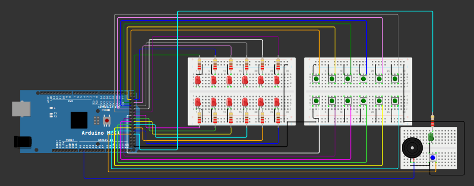

# MegaGenius

  


## Descrição do Projeto

#### O **MegaGenius** é uma versão ampliada do clássico jogo Genius, com **12 botões** e **12 LEDs**. O objetivo do jogo é memorizar e repetir a sequência de luzes exibida pelo sistema. A cada rodada, a sequência aumenta em complexidade, desafiando os reflexos e a memória do jogador.

#### Este projeto foi desenvolvido utilizando o **Arduino Mega 2560**, pela sua grande quantidade de pinos digitais para conectar todos os componentes necessários.


## Materiais Utilizados

- **Placa Arduino Mega 2560**
- **12 LEDs** (cores à sua escolha)
- **12 Botões**
- **Resistores**:
  - 220Ω para os LEDs
  - 10kΩ para os botões
- **Protoboard** e fios de conexão
- Fonte de alimentação adequada para o Arduino Mega


## Pinagem

### LEDs
Os LEDs estão conectados às seguintes portas digitais:

| LED   | Porta |
|-------|-------|
| LED 1 | 23    |
| LED 2 | 25    |
| LED 3 | 27    |
| LED 4 | 29    |
| LED 5 | 31    |
| LED 6 | 33    |
| LED 7 | 35    |
| LED 8 | 37    |
| LED 9 | 39    |
| LED 10| 41    |
| LED 11| 43    |
| LED 12| 45    |
| LED 13(led de início)| 47    |

### Botões
Os botões estão conectados às seguintes portas digitais:

| Botão   | Porta |
|---------|-------|
| Botão 1 | 22    |
| Botão 2 | 24    |
| Botão 3 | 26    |
| Botão 4 | 28    |
| Botão 5 | 30    |
| Botão 6 | 32    |
| Botão 7 | 34    |
| Botão 8 | 36    |
| Botão 9 | 38    |
| Botão 10| 40    |
| Botão 11| 42    |
| Botão 12| 44    |
| Botão 13(botão de início)| 46    |


## Funcionamento do Jogo

1. Para começar o jogo, verifique se o led de início está aceso, e aperte o botão de início para começar o jogo.
2. O jogo começa exibindo uma sequência inicial de um LED.
3. O jogador deve pressionar o botão correspondente ao LED que acendeu.
4. Se o jogador acertar, o jogo adiciona mais um passo à sequência.
5. O jogo continua até que o jogador erre a sequência.
6. Ao final, o sistema reinicia automaticamente para uma nova partida e o led de início é ligado, indicando que uma nova partida pode ser iniciada.


## Instruções de Montagem

1. Conecte os **LEDs** às portas especificadas na seção de **Pinagem**. Use resistores de 220Ω em série com cada LED para evitar danos.
2. Conecte os **botões** às portas especificadas na seção de **Pinagem**. Não é necessária a utilização de resistores de 10kΩ, pois o sistema utiliza o INPUT_PULLUP interno do arduino.
3. Monte o circuito na protoboard, organizando os componentes para facilitar a conexão e manutenção.
4. Conecte o Arduino Mega ao computador via cabo USB.
5. Faça o upload do código do projeto (disponível abaixo) para o Arduino.

## Código

O código completo do projeto está disponível neste repositório. Para usá-lo:

1. Clone este repositório:
   ```bash
   git clone https://github.com/versianih/MegaGenius
   Abra o arquivo .ino no Arduino IDE.
   ```
2. Conecte o Arduino Mega ao computador e faça o upload do código disponível em [genius.ino](genius.ino).

## Contribuições
Contribuições são bem-vindas! Se você tiver sugestões de melhorias ou correções, sinta-se à vontade para abrir uma issue ou enviar um pull request.

## Licença
Este projeto está licenciado sob a [Licença MIT](LICENSE).

## Contato

Se você tiver dúvidas, sugestões, fique à vontade para entrar em contato:

- **GitHub**: [Versianih](https://github.com/versianih)  
- **E-mail**: [versiani.ifes@gmail.com](mailto:versiani.ifes@gmail.com)